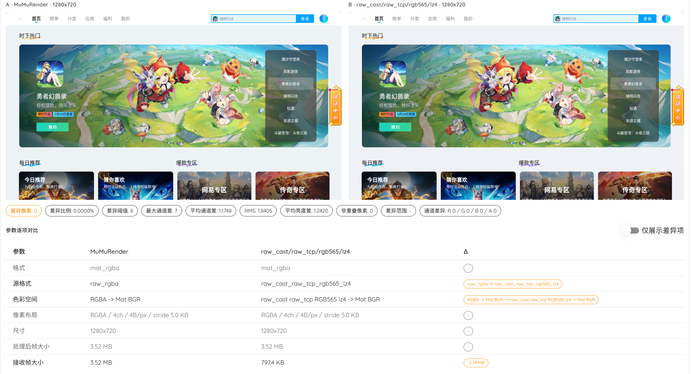

<div align="center">
  

# raw_cast

<p>
  <a href="./LICENSE"></a>
  <a href="https://github.com/TosakaWolf/raw_cast/stargazers"></a>
  <a href="https://github.com/TosakaWolf/raw_cast/releases"></a>
</p>

<p>
  <a href="./README.md">简体中文</a> ·
  <a href="./docs/en/README.md">English</a> ·
  <a href="./docs/ja/README.md">日本語</a>
</p>

<p>
  <strong>raw_cast 是一个 Android 截图和取流工具，无需安装 APK，基于 SurfaceControl + HardwareBuffer。</strong>
</p>

</div>

## 兼容性

目标兼容 Android 6.0 到 Android 14（SDK 23 到 34）。Android 15 及以上需要按设备实测确认。

## 性能基准

以下数据来自 MuMu 模拟器，Android 12，1280x720，测试 `rgb565` 解码并转换为 Mat，连续采样 200 帧且失败数为 0。单帧 `rgb565` 未编码 payload 约 1.76 MB，转换为 Mat 后约 2.64 MB。该结果适合比较同环境下的传输和压缩策略，不代表所有真机表现。

| 组合 | 首帧 | p50 | p95 | 有效 fps | 观察 |
| --- | ---: | ---: | ---: | ---: | --- |
| stdout + `rgb565` | 101 ms | 81 ms | 114 ms | 11.93 | 端口最简单，但未压缩大帧容易被 stdout/ADB 管道拖慢 |
| stdout + `rgb565` + LZ4 | 12 ms | 13 ms | 21 ms | 68.52 | 吞吐提升明显，适合无端口自动化或兜底场景 |
| Raw TCP + `rgb565` | 50 ms | 44 ms | 59 ms | 22.60 | 未压缩时比 stdout 更稳，首帧也更低 |
| Raw TCP + `rgb565` + LZ4 | 18 ms | 12 ms | 19 ms | 73.52 | 延迟低且稳定，是该环境下实时 Mat 管线的优先组合 |
| MuMu render baseline | 7 ms | 7 ms | 8 ms | 133.30 | 模拟器本地渲染基线，不包含 raw_cast 截图和 ADB 传输成本 |

同场景下，MuMuRender 与 `raw_cast/raw_tcp/rgb565/lz4` 的截图对比显示可见像素基本无差异：



结论：`rgb565` + LZ4 在该模拟器环境中显著降低传输压力；Raw TCP + LZ4 是长时间实时流的优先组合，stdout + LZ4 适合单通道自动化、单帧或端口不可用时的兜底。更多性能建议见 [docs/zh/PERFORMANCE.md](docs/zh/PERFORMANCE.md)。

## 快速开始

### Raw TCP 快速接入

默认使用 Raw TCP + `rgb565` + 不压缩。下面是一套宿主集成时的完整流程；`adb shell` 是需要保持存活的前台进程，读到 `READY=1` 后再建立 forward 并连接 Raw TCP。

```shell
# 1. 推送运行包。raw_cast 通过 app_process 启动，不需要安装 APK。
adb push raw_cast.apk /data/local/tmp/raw_cast.apk

# 2. 启动 Raw TCP。stdout 会输出 PID/BIND/READY 状态行，stderr 只用于日志。
adb shell CLASSPATH=/data/local/tmp/raw_cast.apk \
    app_process / ink.mol.raw_cast.Main \
    --port=0 --tcp=53517 --port-retry=10

# 3. 等待 stdout 状态行；BIND:TCP 是设备端实际绑定端口。
# PID=12345
# BIND:TCP=53517
# READY=1

# 4. 读到 READY=1 后，在另一条宿主执行路径中建立 forward。
adb forward tcp:53517 tcp:53517

# 5. 连接 127.0.0.1:53517 后，向 Raw TCP socket 发送一行请求。
# format=rgb565 fps=120 width=0 height=0 compress=none
```

### stdout 与 HTTP 调试通道

ADB stdout 二进制流。stdout 模式不打开网络端口，stdout 是纯 RC01 二进制流，不输出 `PID/BIND/READY` 文本。

> **重要：不要把 stderr 合并到 stdout。** stdout 是二进制帧通道，stderr 只能作为日志通道丢弃或单独读取。

```shell
adb exec-out sh -c 'CLASSPATH=/data/local/tmp/raw_cast.apk \
    app_process / ink.mol.raw_cast.Main \
    --mode=stdout \
    --format=rgb565 \
    --fps=120 \
    --compress=none \
    2>/dev/null'
```

开启 LZ4 或抓取单帧：

```shell
adb exec-out sh -c 'CLASSPATH=/data/local/tmp/raw_cast.apk \
    app_process / ink.mol.raw_cast.Main \
    --mode=stdout \
    --format=rgb565 \
    --fps=120 \
    --compress=lz4 \
    2>/dev/null'

adb exec-out sh -c 'CLASSPATH=/data/local/tmp/raw_cast.apk \
    app_process / ink.mol.raw_cast.Main \
    --mode=stdout \
    --format=rgb565 \
    --oneshot \
    --compress=none \
    2>/dev/null'
```

HTTP 仅作为浏览器预览和调试取流通道：

```shell
adb shell CLASSPATH=/data/local/tmp/raw_cast.apk \
    app_process / ink.mol.raw_cast.Main \
    --port=53516 --tcp=53517 --port-retry=10

# 读到 READY=1 后，按 BIND 输出的实际端口 forward。
adb forward tcp:53516 tcp:53516
adb forward tcp:53517 tcp:53517

# HTTP 调试 stream 仍建议使用 rgb565，LZ4 可选。
# http://127.0.0.1:53516/stream?format=rgb565&fps=120&compress=none
# http://127.0.0.1:53516/stream?format=rgb565&fps=120&compress=lz4
```

## 文档

| 文档 | 链接 |
| --- | --- |
| 命令行参数、端口输出和启动示例 | [docs/zh/CLI.md](docs/zh/CLI.md) |
| Raw TCP、stdout、HTTP 调试通道 | [docs/zh/TRANSPORTS.md](docs/zh/TRANSPORTS.md) |
| RC01 帧头、格式 id、LZ4 规则 | [docs/zh/PROTOCOL.md](docs/zh/PROTOCOL.md) |
| 宿主端集成建议 | [docs/zh/INTEGRATION.md](docs/zh/INTEGRATION.md) |
| 格式、传输和性能建议 | [docs/zh/PERFORMANCE.md](docs/zh/PERFORMANCE.md) |
| 常见问题排查 | [docs/zh/TROUBLESHOOTING.md](docs/zh/TROUBLESHOOTING.md) |

## 可选参数

### 启动参数

启动参数用于 `app_process`。网络模式推荐只配置端口；像素格式、FPS、压缩等通常由 Raw TCP 请求行决定。HTTP query 仅用于调试通道。stdout 模式直接使用启动参数里的截图选项。

| 参数 | 常用 | 默认 | 可选值 | 说明 |
| --- | --- | --- | --- | --- |
| `--tcp=N` | 是 | `0` | `0..65535` | Raw TCP 端口；`0` 表示关闭 |
| `--port=N` | 调试常用 | `53516` | `0..65535` | HTTP/1.1 端口；`0` 表示关闭 |
| `--port-retry=N` | 是 | `10` | `1..100` | 端口占用时向后尝试的次数 |
| `--mode=stdout` / `--stdout` | 是 | 关闭 | - | stdout 二进制流模式，不打开网络端口 |
| `--format=NAME` | stdout 常用 | `rgb565` | `rgb565`、`rgba`、`png`、`webp` | stdout 输出格式；网络模式通常改用请求参数 |
| `--fps=N` | stdout 常用 | `30` | `0..120` | stdout 帧率；stdout 中 `0` 表示单帧 |
| `--compress=lz4` / `--lz4` | 常用 | `none` | `none`、`lz4` | `rgb565/rgba` 可选 LZ4；PNG/WEBP 不叠加 LZ4 |
| `--oneshot` | stdout 常用 | 关闭 | - | stdout 输出一帧后退出 |
| `--width=N` | 按需 | `0` | `0..` | 输出宽度；`0` 使用当前设备尺寸 |
| `--height=N` | 按需 | `0` | `0..` | 输出高度；`0` 使用当前设备尺寸 |
| `--quality=N` | 图片格式按需 | `100` | `1..100` | WEBP 质量；仅图片格式使用 |

### 取流 / 截图请求参数

Raw TCP 在连接后发送一行空格分隔的 `key=value`；HTTP 调试通道使用 query string。推荐默认使用 `format=rgb565`，可选 `compress=lz4`。

| 参数 | 常用 | 默认 | 可选值 | 适用 | 说明 |
| --- | --- | --- | --- | --- | --- |
| `format` | 是 | `rgb565` | `rgb565`、`rgba`、`png`、`webp` | Raw TCP / HTTP | 输出像素或图片格式 |
| `fps` | 是 | `30` | Raw TCP: `0..120`；HTTP stream: `1..120` | Raw TCP / HTTP stream | 连续取流帧率；Raw TCP 中 `0` 表示单帧 |
| `compress` | 是 | `none` | `none`、`lz4` | `rgb565/rgba` | LZ4 压缩开关 |
| `width` | 按需 | `0` | `0..` | Raw TCP / HTTP | 输出宽度；`0` 使用当前设备尺寸 |
| `height` | 按需 | `0` | `0..` | Raw TCP / HTTP | 输出高度；`0` 使用当前设备尺寸 |
| `quality` | 图片格式按需 | `100` | `1..100` | `webp` | WEBP 质量 |

## 推荐实践

| 场景 | 推荐方式 |
| --- | --- |
| 实时 Mat / OpenCV / 推理 | Raw TCP，`format=rgb565`，优先测试 `compress=lz4` |
| 无端口或自动化兜底 | ADB stdout，`format=rgb565`，可选 `compress=lz4` |
| 需要完整 4 通道 `rgba` 像素 | `format=rgba`，同样可选 `compress=lz4` |
| 浏览器人工查看 | HTTP `/preview`，仅作为调试预览，不作为高频 benchmark 通道 |

## 核心能力

| 能力 | 说明 |
| --- | --- |
| 运行方式 | **无需安装 APK**，`adb push` 后通过 `app_process` 启动 |
| 截图路径 | **SurfaceControl + HardwareBuffer** |
| 正式传输 | **Raw TCP**、**ADB stdout**；HTTP 仅用于调试 |
| 默认像素 | 各模式推荐默认 `RGB_565`，需要完整 4 通道时使用 `RGBA_8888` |
| 压缩 | `rgb565/rgba` 可选 LZ4；PNG/WEBP 不叠加 LZ4 |
| 浏览器查看 | HTTP `/preview` 返回调试用单帧预览图片 |

## 传输与格式

| 传输 | 入口 | 内容 |
| --- | --- | --- |
| Raw TCP | `--tcp=PORT` | 8 字节 banner 后连续输出 RC01 帧 |
| ADB stdout | `--mode=stdout` | 8 字节 banner 后从标准输出连续输出 RC01 帧 |
| HTTP/1.1 keep-alive | `--port=PORT` | 调试用 `/screenshot`、`/preview`、`/stream` |

通用参数：

```text
width=NNN  height=NNN  format=rgb565|rgba|png|webp
compress=none|lz4  quality=1..100  fps=1..120
```

`compress=lz4` 只对 `rgb565/rgba` 生效。`quality=` 只对 WEBP 有意义。

| `format=` | 协议 id | 字节/像素 | 用途 |
| --- | ---: | ---: | --- |
| `rgb565` | 1 | 2 | 默认推荐；相比 `rgba` 像素负载减半，但仍是未编码全帧数据 |
| `rgba` | 2 | 4 | Android 原生 4 通道顺序 |
| `png` | 11 | - | 无损图片 |
| `webp` | 12 | - | 有损或无损图片，取决于 `quality=` 和系统版本 |

格式 id `3` 已保留不用；PNG 保持 id `11`，WEBP 保持 id `12`，以兼容已有客户端。

## RC01 帧

Raw TCP、ADB stdout 和 HTTP 调试 `/stream` 使用同一个 32 字节小端帧头：

```text
offset  size  field
0       4     magic = 'R','C','0','1'
4       1     version = 1
5       1     flags, bit0 = LZ4
6       2     format, see PixelFmt id
8       4     seq
12      4     width
16      4     height
20      4     stride
24      4     payload_size
28      4     timestamp_ms
```

Raw TCP 和 ADB stdout 会先输出 8 字节 banner：

```text
'R','C','0','1' + little-endian uint32 protocol_version
```

HTTP `/stream` 使用 chunked response；每个 chunk 是一帧完整的 RC01 header + payload。详见 [docs/zh/PROTOCOL.md](docs/zh/PROTOCOL.md)。

## 致谢与参考

- [DroidCast_raw](https://github.com/Torther/DroidCast_raw)

## License

raw_cast is licensed under the GNU Affero General Public License v3.0 or later.

SPDX-License-Identifier: `AGPL-3.0-or-later`

Third-party code and referenced upstream work retain their original licenses.
See [NOTICE](NOTICE) and the license files inside each third-party directory,
including `app/src/main/cpp/lz4`.
