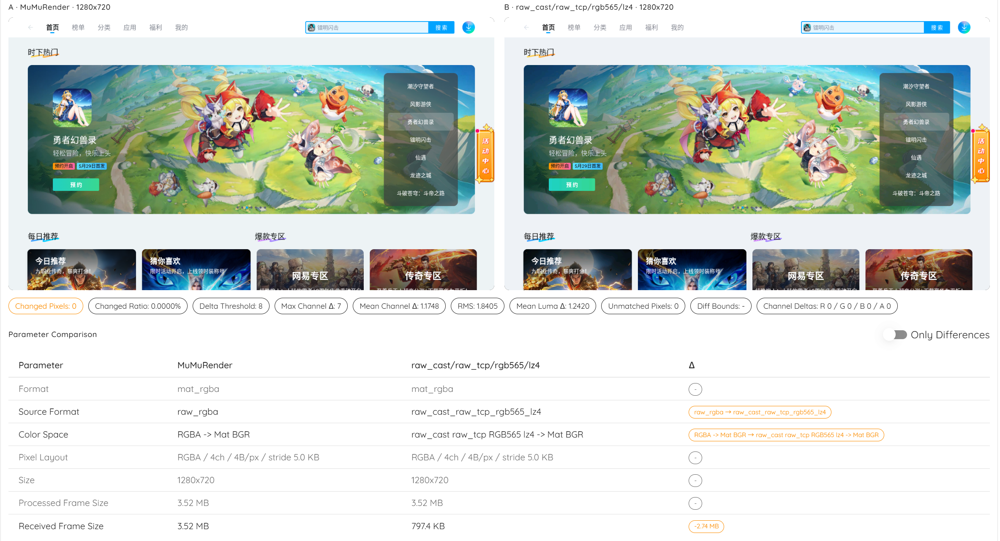

# raw_cast Docs

<p>
  <a href="../../README.md">简体中文</a> ·
  <a href="./README.md">English</a> ·
  <a href="../ja/README.md">日本語</a>
</p>

raw_cast is an Android screenshot and streaming tool. It does not require APK installation and is based on SurfaceControl + HardwareBuffer.

## Compatibility

Target compatibility: Android 6.0 through Android 14, SDK 23 through 34. Android 15 and later should be verified per device.

## Performance Benchmark

The following reference run used MuMu emulator 12, Android 12, 1280x720, decoding `rgb565` frames into Mat for 200 samples with 0 failures. Each unencoded `rgb565` payload was about 1.76 MB, and the converted Mat was about 2.64 MB. Treat these numbers as transport and compression comparisons within that environment, not universal device results.

| Combo | First frame | p50 | p95 | Effective fps | Observation |
| --- | ---: | ---: | ---: | ---: | --- |
| stdout + `rgb565` | 101 ms | 81 ms | 114 ms | 11.93 | Simplest startup path, but uncompressed large frames can be limited by stdout and ADB pipe throughput |
| stdout + `rgb565` + LZ4 | 12 ms | 13 ms | 21 ms | 68.52 | Much higher throughput, useful for no-port automation and fallback paths |
| Raw TCP + `rgb565` | 50 ms | 44 ms | 59 ms | 22.60 | More stable than stdout when uncompressed, with much lower first-frame latency |
| Raw TCP + `rgb565` + LZ4 | 18 ms | 12 ms | 19 ms | 73.52 | Low and stable latency, the preferred combo for real-time Mat pipelines in this environment |
| MuMu render baseline | 7 ms | 7 ms | 8 ms | 133.30 | Emulator-local render baseline; excludes raw_cast capture and ADB transfer cost |

In the same scene, MuMuRender and `raw_cast/raw_tcp/rgb565/lz4` were visually indistinguishable:



Takeaway: `rgb565` + LZ4 greatly reduces transfer pressure in this emulator test. Raw TCP + LZ4 is the better default for long-running real-time streams; stdout + LZ4 remains useful for single-channel automation, one-shot capture, or port-unavailable fallback. For more performance recommendations, see [PERFORMANCE.md](PERFORMANCE.md).

## Quick Start

<a id="python-example"></a>

### Python Example

Raw TCP `rgb565` + LZ4 example:

```shell
cd examples/python
python -m pip install -r requirements.txt
python raw_tcp_rgb565_lz4_viewer.py --adb-address 127.0.0.1:16384
```

### Raw TCP Integration

The default uses Raw TCP + `rgb565` + no compression. The block below shows the complete host integration flow; `adb shell` is a foreground process that must stay alive. After `READY=1`, create the forward and connect Raw TCP.

```shell
# 1. Push the runtime package. raw_cast runs through app_process; it is not installed.
adb push raw_cast.apk /data/local/tmp/raw_cast.apk

# 2. Start Raw TCP. stdout prints PID/BIND/READY status lines; stderr is log-only.
adb shell CLASSPATH=/data/local/tmp/raw_cast.apk \
    app_process / ink.mol.raw_cast.Main \
    --port=0 --tcp=53517 --port-retry=10

# 3. Wait for stdout status lines; BIND:TCP is the actual device-side port.
# PID=12345
# BIND:TCP=53517
# READY=1

# 4. After READY=1, create the forward from another host execution path.
adb forward tcp:53517 tcp:53517

# 5. Connect to 127.0.0.1:53517, then send one request line to the Raw TCP socket.
# format=rgb565 fps=120 width=0 height=0 compress=none
```

### stdout And HTTP Debug Streams

ADB stdout binary stream. stdout mode opens no network port. stdout is the pure RC01 binary stream and does not print `PID/BIND/READY`.

> **Important: never merge stderr into stdout.** stdout is the binary frame channel; stderr must be discarded or read separately as logs.

```shell
adb exec-out sh -c 'CLASSPATH=/data/local/tmp/raw_cast.apk \
    app_process / ink.mol.raw_cast.Main \
    --mode=stdout \
    --format=rgb565 \
    --fps=120 \
    --compress=none \
    2>/dev/null'
```

Enable LZ4 or capture one frame:

```shell
adb exec-out sh -c 'CLASSPATH=/data/local/tmp/raw_cast.apk \
    app_process / ink.mol.raw_cast.Main \
    --mode=stdout \
    --format=rgb565 \
    --fps=120 \
    --compress=lz4 \
    2>/dev/null'

adb exec-out sh -c 'CLASSPATH=/data/local/tmp/raw_cast.apk \
    app_process / ink.mol.raw_cast.Main \
    --mode=stdout \
    --format=rgb565 \
    --oneshot \
    --compress=none \
    2>/dev/null'
```

HTTP is only for browser preview and debug streaming:

```shell
adb shell CLASSPATH=/data/local/tmp/raw_cast.apk \
    app_process / ink.mol.raw_cast.Main \
    --port=53516 --tcp=53517 --port-retry=10

# After READY=1, forward the actual ports printed by BIND.
adb forward tcp:53516 tcp:53516
adb forward tcp:53517 tcp:53517

# HTTP debug stream should still use rgb565. LZ4 is optional.
# http://127.0.0.1:53516/stream?format=rgb565&fps=120&compress=none
# http://127.0.0.1:53516/stream?format=rgb565&fps=120&compress=lz4
```

## Documents

| Document | Link |
| --- | --- |
| Command-line options, stdout status lines, launch examples | [CLI.md](CLI.md) |
| Raw TCP, stdout, HTTP debug channel | [TRANSPORTS.md](TRANSPORTS.md) |
| RC01 frame format, format ids, LZ4 rules | [PROTOCOL.md](PROTOCOL.md) |
| Python, Go, Node.js, and Java integration notes | [INTEGRATION.md](INTEGRATION.md) |
| Format, transport, and compression tradeoffs | [PERFORMANCE.md](PERFORMANCE.md) |
| Common launch, connection, and parsing issues | [TROUBLESHOOTING.md](TROUBLESHOOTING.md) |

## Optional Parameters

### Launch options

Launch options are passed to `app_process`. In network mode, usually configure only ports; pixel format, FPS, and compression are normally selected by the Raw TCP request line. HTTP query parameters are for the debug channel. stdout mode uses the capture options directly.

| Option | Common | Default | Values | Notes |
| --- | --- | --- | --- | --- |
| `--tcp=N` | Yes | `0` | `0..65535` | Raw TCP port; `0` disables it |
| `--port=N` | Common for debug | `53516` | `0..65535` | HTTP/1.1 port; `0` disables it |
| `--port-retry=N` | Yes | `10` | `1..100` | Number of successive ports to try when busy |
| `--mode=stdout` / `--stdout` | Yes | Off | - | stdout binary stream mode; opens no network port |
| `--format=NAME` | Common for stdout | `rgb565` | `rgb565`, `rgba`, `png`, `webp` | stdout output format; network mode usually uses request parameters |
| `--fps=N` | Common for stdout | `30` | `0..120` | stdout frame rate; `0` means one frame in stdout mode |
| `--compress=lz4` / `--lz4` | Yes | `none` | `none`, `lz4` | Optional LZ4 for `rgb565/rgba`; PNG/WEBP are not wrapped in LZ4 |
| `--oneshot` | Common for stdout | Off | - | Emit one stdout frame and exit |
| `--width=N` | As needed | `0` | `0..` | Output width; `0` uses the current device size |
| `--height=N` | As needed | `0` | `0..` | Output height; `0` uses the current device size |
| `--quality=N` | Image formats | `100` | `1..100` | WEBP quality; only used by image formats |

### Stream / screenshot request parameters

Raw TCP sends one whitespace-separated `key=value` line after connecting; the HTTP debug channel uses a query string. Use `format=rgb565` by default, with optional `compress=lz4`.

| Parameter | Common | Default | Values | Applies to | Notes |
| --- | --- | --- | --- | --- | --- |
| `format` | Yes | `rgb565` | `rgb565`, `rgba`, `png`, `webp` | Raw TCP / HTTP | Output pixel or image format |
| `fps` | Yes | `30` | Raw TCP: `0..120`; HTTP stream: `1..120` | Raw TCP / HTTP stream | Streaming frame rate; Raw TCP `0` means one frame |
| `compress` | Yes | `none` | `none`, `lz4` | `rgb565/rgba` | LZ4 compression switch |
| `width` | As needed | `0` | `0..` | Raw TCP / HTTP | Output width; `0` uses the current device size |
| `height` | As needed | `0` | `0..` | Raw TCP / HTTP | Output height; `0` uses the current device size |
| `quality` | Image formats | `100` | `1..100` | `webp` | WEBP quality |

## Best Practices

| Scenario | Recommended setup |
| --- | --- |
| Real-time Mat / OpenCV / inference | Raw TCP, `format=rgb565`, test `compress=lz4` first |
| No-port or automation fallback | ADB stdout, `format=rgb565`, optional `compress=lz4` |
| Need full 4-channel raw pixels | `format=rgba`, with optional `compress=lz4` |
| Manual browser inspection | HTTP `/preview`; use it for debugging, not high-frequency benchmarks |

## Transports and Formats

| Transport | Entry | Contents |
| --- | --- | --- |
| Raw TCP | `--tcp=PORT` | Continuous RC01 frames after an 8-byte banner |
| ADB stdout | `--mode=stdout` | Continuous RC01 frames on stdout after an 8-byte banner |
| HTTP/1.1 keep-alive | `--port=PORT` | Debug `/screenshot`, `/preview`, `/stream` |

| `format=` | Protocol id | Bytes/pixel | Use |
| --- | ---: | ---: | --- |
| `rgb565` | 1 | 2 | Recommended default; half the pixel payload of `rgba`, but still full-frame unencoded data |
| `rgba` | 2 | 4 | Android native 4-channel order |
| `png` | 11 | - | Lossless image |
| `webp` | 12 | - | Lossy or lossless image depending on `quality=` and system version |

`compress=lz4` only applies to `rgb565/rgba`. PNG/WEBP are not wrapped in LZ4.
