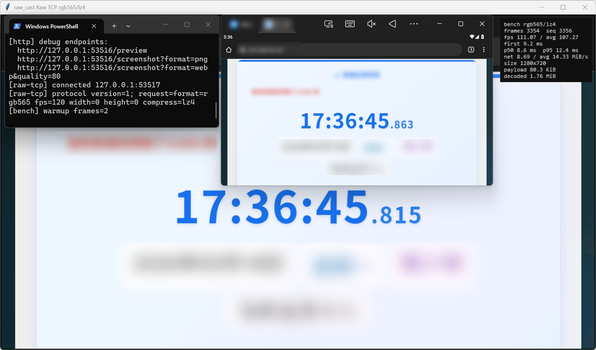

# raw_cast ドキュメント

<p>
  <a href="../../README.md">简体中文</a> ·
  <a href="../en/README.md">English</a> ·
  <a href="./README.md">日本語</a>
</p>

## 概要

raw_cast は ADB ベースで動作する Android のリアルタイム画面キャプチャ、ストリーミング、スクリーンショットツールです。APK のインストールは不要で、SurfaceControl + HardwareBuffer を利用します。

## 互換性

対象互換範囲は Android 6.0 から Android 15（SDK 23 から 35）です。

## ベンチマーク参考

<table>
  <tr>
    <td width="50%" align="center" valign="top">
      <strong>サンプルコードテスト</strong><br>
      
      <br>
      <sub><code>raw_tcp_rgb565_lz4</code> サンプルコードテスト結果。</sub>
    </td>
    <td width="50%" align="center" valign="top">
      <strong>ピクセル差分</strong><br>
      <br>
      <sub>同じシーンでは、両者の可視ピクセル差はほぼありません。</sub>
    </td>
  </tr>
</table>

以下は MuMu エミュレーター 12、Android 12、1280x720 で、`rgb565` を Mat に変換した参考値です。

<table>
  <tr><th>組み合わせ</th><th>初回フレーム</th><th>p50</th><th>p95</th><th>実効 fps</th><th>概要</th></tr>
  <tr><td>stdout + <code>rgb565</code></td><td align="right">101 ms</td><td align="right">81 ms</td><td align="right">114 ms</td><td align="right">11.93</td><td>未圧縮大フレームは stdout/ADB throughput の制約を受けやすい</td></tr>
  <tr><td>stdout + <code>rgb565</code> + LZ4</td><td align="right">12 ms</td><td align="right">13 ms</td><td align="right">21 ms</td><td align="right">68.52</td><td>LZ4 で throughput が改善し、ポートなし用途に向きます</td></tr>
  <tr><td>Raw TCP + <code>rgb565</code></td><td align="right">50 ms</td><td align="right">44 ms</td><td align="right">59 ms</td><td align="right">22.60</td><td>stdout より安定しますが、帯域負荷は残ります</td></tr>
  <tr><td>Raw TCP + <code>rgb565</code> + LZ4</td><td align="right">18 ms</td><td align="right">12 ms</td><td align="right">19 ms</td><td align="right">73.52</td><td>低 latency で安定し、リアルタイム stream 向きです</td></tr>
  <tr><td>MuMu render baseline</td><td align="right">7 ms</td><td align="right">7 ms</td><td align="right">8 ms</td><td align="right">133.30</td><td>ローカル render baseline。capture と転送 cost は含みません</td></tr>
  <tr><td colspan="6">この emulator 環境では <code>rgb565</code> + LZ4 が転送負荷を大きく下げます。長時間のリアルタイム stream では Raw TCP + LZ4 を優先し、stdout + LZ4 は単一 channel の自動化、one-shot、ポートが使えない場合の fallback として使うのが向いています。その他の性能上の推奨は <a href="PERFORMANCE.md">PERFORMANCE.md</a> を参照してください。</td></tr>
</table>

## クイックスタート

<a id="python-example"></a>

### Python Example

Raw TCP `rgb565` + LZ4 の例:

```shell
cd examples/python
python -m pip install -r requirements.txt
python raw_tcp_rgb565_lz4_viewer.py --adb-address 127.0.0.1:16384
```

### Raw TCP の組み込み

既定では Raw TCP + `rgb565` + 圧縮なしを使います。以下はホスト組み込み時の完全な流れです。`adb shell` は保持する必要があるフォアグラウンドプロセスで、`READY=1` を受け取ってから forward を作成し Raw TCP に接続します。

```shell
# 1. runtime package を push。raw_cast は app_process で起動し、install は不要です。
adb push raw_cast.apk /data/local/tmp/raw_cast.apk

# 2. Raw TCP を起動。stdout は PID/BIND/READY の状態行、stderr はログ専用です。
adb shell CLASSPATH=/data/local/tmp/raw_cast.apk \
    app_process / ink.mol.raw_cast.Main \
    --port=0 --tcp=53517 --port-retry=10

# 3. stdout の状態行を待ちます。BIND:TCP は端末側の実バインドポートです。
# PID=12345
# BIND:TCP=53517
# READY=1

# 4. READY=1 の後、別のホスト実行経路で forward を作成します。
adb forward tcp:53517 tcp:53517

# 5. 127.0.0.1:53517 に接続し、Raw TCP socket に 1 行の request を送ります。
# format=rgb565 fps=120 width=0 height=0 compress=none
```

### stdout と HTTP debug stream

ADB stdout binary stream。stdout モードはネットワークポートを開きません。stdout は純粋な RC01 binary stream で、`PID/BIND/READY` テキストは出力しません。

> **重要：stderr を stdout に混ぜないでください。** stdout は binary frame channel です。stderr はログとして破棄するか別に読み取ってください。

```shell
adb exec-out sh -c 'CLASSPATH=/data/local/tmp/raw_cast.apk \
    app_process / ink.mol.raw_cast.Main \
    --mode=stdout \
    --format=rgb565 \
    --fps=120 \
    --compress=none \
    2>/dev/null'
```

LZ4 を有効化、または 1 フレームだけ取得：

```shell
adb exec-out sh -c 'CLASSPATH=/data/local/tmp/raw_cast.apk \
    app_process / ink.mol.raw_cast.Main \
    --mode=stdout \
    --format=rgb565 \
    --fps=120 \
    --compress=lz4 \
    2>/dev/null'

adb exec-out sh -c 'CLASSPATH=/data/local/tmp/raw_cast.apk \
    app_process / ink.mol.raw_cast.Main \
    --mode=stdout \
    --format=rgb565 \
    --oneshot \
    --compress=none \
    2>/dev/null'
```

HTTP はブラウザ preview と debug stream 専用です。

```shell
adb shell CLASSPATH=/data/local/tmp/raw_cast.apk \
    app_process / ink.mol.raw_cast.Main \
    --port=53516 --tcp=53517 --port-retry=10

# READY=1 の後、BIND が出力した実ポートへ forward。
adb forward tcp:53516 tcp:53516
adb forward tcp:53517 tcp:53517

# HTTP debug stream でも rgb565 を推奨します。LZ4 は任意です。
# http://127.0.0.1:53516/stream?format=rgb565&fps=120&compress=none
# http://127.0.0.1:53516/stream?format=rgb565&fps=120&compress=lz4
```

## ドキュメント

| 文書 | リンク |
| --- | --- |
| コマンドライン引数、stdout の状態行、起動例 | [CLI.md](CLI.md) |
| Raw TCP、stdout、HTTP debug channel | [TRANSPORTS.md](TRANSPORTS.md) |
| RC01 フレーム形式、format id、LZ4 ルール | [PROTOCOL.md](PROTOCOL.md) |
| Python、Go、Node.js、Java 連携 | [INTEGRATION.md](INTEGRATION.md) |
| format、transport、compression の性能上の違い | [PERFORMANCE.md](PERFORMANCE.md) |
| 起動、接続、解析のよくある問題 | [TROUBLESHOOTING.md](TROUBLESHOOTING.md) |

## オプションパラメータ

### 起動オプション

起動オプションは `app_process` に渡します。ネットワークモードでは通常ポートだけを設定し、pixel format、FPS、compression は Raw TCP request line で指定します。HTTP query は debug channel 用です。stdout モードでは起動オプションの capture 設定を直接使います。

| オプション | よく使う | 既定値 | 値 | 説明 |
| --- | --- | --- | --- | --- |
| `--tcp=N` | はい | `0` | `0..65535` | Raw TCP ポート。`0` で無効 |
| `--port=N` | debug で使用 | `53516` | `0..65535` | HTTP/1.1 ポート。`0` で無効 |
| `--port-retry=N` | はい | `10` | `1..100` | ポート使用中に後続ポートを試す回数 |
| `--mode=stdout` / `--stdout` | はい | 無効 | - | stdout binary stream mode。ネットワークポートを開きません |
| `--format=NAME` | stdout で使用 | `rgb565` | `rgb565`、`rgba`、`png`、`webp` | stdout 出力 format。ネットワークモードでは通常 request parameter を使います |
| `--fps=N` | stdout で使用 | `30` | `0..120` | stdout frame rate。stdout では `0` が 1 フレーム |
| `--compress=lz4` / `--lz4` | はい | `none` | `none`、`lz4` | `rgb565/rgba` 用の LZ4。PNG/WEBP は LZ4 で包みません |
| `--oneshot` | stdout で使用 | 無効 | - | stdout で 1 フレーム出力して終了 |
| `--width=N` | 必要に応じて | `0` | `0..` | 出力幅。`0` は現在の端末サイズ |
| `--height=N` | 必要に応じて | `0` | `0..` | 出力高さ。`0` は現在の端末サイズ |
| `--quality=N` | 画像 format 用 | `100` | `1..100` | WEBP 品質。画像 format のみ |

### Stream / screenshot request parameter

Raw TCP は接続後に空白区切りの `key=value` を 1 行送ります。HTTP debug channel は query string を使います。既定は `format=rgb565` を推奨し、`compress=lz4` を選択できます。

| パラメータ | よく使う | 既定値 | 値 | 対象 | 説明 |
| --- | --- | --- | --- | --- | --- |
| `format` | はい | `rgb565` | `rgb565`、`rgba`、`png`、`webp` | Raw TCP / HTTP | 出力 pixel または image format |
| `fps` | はい | `30` | Raw TCP: `0..120`、HTTP stream: `1..120` | Raw TCP / HTTP stream | stream frame rate。Raw TCP の `0` は 1 フレーム |
| `compress` | はい | `none` | `none`、`lz4` | `rgb565/rgba` | LZ4 compression switch |
| `width` | 必要に応じて | `0` | `0..` | Raw TCP / HTTP | 出力幅。`0` は現在の端末サイズ |
| `height` | 必要に応じて | `0` | `0..` | Raw TCP / HTTP | 出力高さ。`0` は現在の端末サイズ |
| `quality` | 画像 format 用 | `100` | `1..100` | `webp` | WEBP 品質 |

## ベストプラクティス

| シナリオ | 推奨設定 |
| --- | --- |
| リアルタイム Mat / OpenCV / 推論 | Raw TCP、`format=rgb565`、まず `compress=lz4` をテスト |
| ポートが使えない場合や自動化 fallback | ADB stdout、`format=rgb565`、必要に応じて `compress=lz4` |
| 4 channel raw pixels が必要 | `format=rgba`、必要に応じて `compress=lz4` |
| ブラウザで手動確認 | HTTP `/preview`。debug 用で、高頻度 benchmark 用ではありません |

## Transport と Format

| Transport | Entry | 内容 |
| --- | --- | --- |
| Raw TCP | `--tcp=PORT` | 8 byte banner の後に連続 RC01 frames |
| ADB stdout | `--mode=stdout` | 8 byte banner の後に stdout へ連続 RC01 frames |
| HTTP/1.1 keep-alive | `--port=PORT` | debug 用 `/screenshot`、`/preview`、`/stream` |

| `format=` | Protocol id | bytes/pixel | 用途 |
| --- | ---: | ---: | --- |
| `rgb565` | 1 | 2 | 推奨既定。`rgba` の半分の pixel payload ですが、全フレームの未エンコードデータです |
| `rgba` | 2 | 4 | Android native 4 channel order |
| `png` | 11 | - | lossless image |
| `webp` | 12 | - | `quality=` と system version に依存する lossy/lossless image |

`compress=lz4` は `rgb565/rgba` のみに適用されます。PNG/WEBP は LZ4 で包みません。
